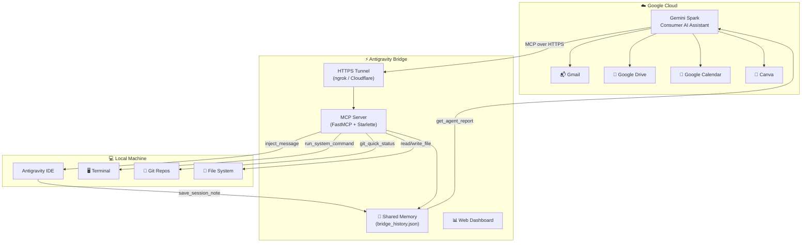

<div align="center">

# ⚡ Gemini Antigravity Bridge

### The World's First Bidirectional MCP Bridge Between Google Gemini Spark & DeepMind Antigravity

[](https://python.org)
[](https://modelcontextprotocol.io)
[](LICENSE)
[](tests/)
[](https://gemini.google.com)
[](https://deepmind.google)

**Connect Google's cloud AI (Gemini Spark) to your local agentic IDE (Antigravity) with 23 powerful MCP tools — enabling autonomous task dispatch, shared memory, file operations, and cross-agent orchestration.**

[Quick Start](#-quick-start) · [Architecture](#-architecture) · [Tools](#-available-tools-23) · [Connected Apps](#-spark-connected-apps) · [Deploy](#-deployment)

</div>

---

## 🌐 What Is This?

**Gemini Antigravity Bridge** is an MCP (Model Context Protocol) server that creates a **persistent, bidirectional communication channel** between:

- ☁️ **Google Gemini Spark** (cloud-based AI assistant with Google Workspace access)
- 💻 **Google DeepMind Antigravity** (local agentic IDE with full system access)

This enables a **fully autonomous loop** where Spark can dispatch coding tasks to your local machine, and Antigravity can request cloud intelligence back from Spark — all through a standardized, secure protocol.

```
┌──────────────────────────────────────────────────────────────────┐
│                    GEMINI SPARK (Google Cloud)                    │
│  📬 Gmail │ 📁 Drive │ 📅 Calendar │ 🎨 Canva │ 🎥 YouTube     │
└─────────────────────────┬────────────────────────────────────────┘
                          │ MCP over HTTPS
                          ▼
┌──────────────────────────────────────────────────────────────────┐
│              ⚡ GEMINI ANTIGRAVITY BRIDGE (MCP Server)            │
│                                                                  │
│  🔧 System Commands    📂 File Operations    🤖 Agent Dispatch   │
│  🧠 Shared Memory      🔄 Project Sync       📊 Status Reports  │
│                                                                  │
│  Tunnel: ngrok / Cloudflare (permanent HTTPS domain)             │
└─────────────────────────┬────────────────────────────────────────┘
                          │ Local MCP + Message Injection
                          ▼
┌──────────────────────────────────────────────────────────────────┐
│             ANTIGRAVITY IDE (Local Machine)                       │
│  🖥️ Terminal │ 📝 Code Editor │ 🌳 Git │ 🧪 Tests │ 🚀 Deploy  │
└──────────────────────────────────────────────────────────────────┘
```

---

## 🏆 Why This Bridge?

| Feature | This Project | Other MCP Servers |
|---|:---:|:---:|
| Bidirectional Cloud ↔ Local | ✅ | ❌ |
| Autonomous Agent Task Dispatch | ✅ | ❌ |
| Cross-Agent Shared Memory | ✅ | ❌ |
| Antigravity Conversation Injection | ✅ | ❌ |
| Spark Connected Apps Orchestration | ✅ | ❌ |
| Google Workspace Integration | ✅ (via Spark) | Partial |
| Local File System Access | ✅ | Some |
| System Command Execution | ✅ | Some |

---

## 🚀 Quick Start

### Prerequisites
- Python 3.10+
- [ngrok account](https://ngrok.com) (free tier) with a reserved domain
- Google Gemini Spark (Advanced/Ultra subscription)
- Google DeepMind Antigravity IDE

### Installation

```bash
# Clone the repository
git clone https://github.com/nandhakumar-murugan/gemini-antigravity-bridge.git
cd gemini-antigravity-bridge

# Install dependencies or install package directly
pip install -r requirements.txt
# OR install as a CLI tool:
pip install -e .

# Configure environment
cp .env.example .env
# Edit .env with your NGROK_AUTHTOKEN and NGROK_DOMAIN

# Launch the bridge (via script or CLI)
gemini-bridge
# or: python run_with_tunnel.py
```

### Connect to Gemini Spark

1. Open [Gemini Spark](https://gemini.google.com) → Settings → Connected Apps
2. Click **"Add a custom app"**
3. Enter your public MCP URL: `https://your-domain.ngrok-free.dev/mcp`
4. Spark will discover all 23 tools automatically!

---

## 🛠️ Available Tools (23)

### 🔧 System Execution
| Tool | Description |
|---|---|
| `run_system_command` | Execute any shell/PowerShell command with captured stdout/stderr |
| `run_batch_commands` | Run multiple commands sequentially with error handling |

### 📂 File Operations
| Tool | Description |
|---|---|
| `read_file` | Read file contents from any path on the local machine |
| `write_file` | Create or overwrite files with specified content |
| `edit_file` | Surgically edit specific lines in existing files |
| `append_file` | Append content to the end of a file |
| `batch_write_files` | Create multiple files in a single operation |
| `create_full_project` | Scaffold an entire project directory structure |
| `list_directory` | List directory contents with metadata |

### 🤖 Agent Orchestration
| Tool | Description |
|---|---|
| `run_agent_task` | Launch an autonomous Antigravity coding subagent |
| `get_agent_status` | Check status and output of a running agent task |
| `terminate_task` | Kill a running agent task |

### 🧠 Shared Memory & Sync
| Tool | Description |
|---|---|
| `get_bridge_history` | Retrieve full cross-client operation history |
| `save_session_note` | Write a structured note to shared memory (tagged) |
| `get_session_notes` | Read session notes by tag or date range |
| `sync_project_to_gemini` | Sync project metadata to Spark's knowledge base |
| `git_quick_status` | Quick Git status check for any repository |

### 🌐 Spark Connected Apps
| Tool | Description |
|---|---|
| `request_spark_connected_app_action` | Dispatch tasks to Spark's connected apps (@Canva, @YouTube, @Gmail, etc.) |
| `get_spark_connected_apps_catalog` | List all available connected apps and capabilities |

### 🔗 Antigravity Deep Integration
| Tool | Description |
|---|---|
| `list_antigravity_conversations` | List all active Antigravity IDE conversations |
| `inject_message` | Inject a structured message directly into an Antigravity conversation |
| `send_spark_to_antigravity_task` | Dispatch a full task brief from Spark to Antigravity |
| `get_antigravity_agent_report` | Get the latest execution report for Spark to review |

---

## 🔄 Spark Connected Apps

Through the bridge, Antigravity can orchestrate Spark's connected Google & third-party apps:

| App | Capabilities |
|---|---|
| 🎨 **@Canva** | Poster design, infographics, slide decks |
| 📁 **@Google Drive** | Cloud file search, folder management |
| 📝 **@Google Docs** | Document creation and collaboration |
| 📌 **@Google Keep** | Quick notes, flashcards, checklists |
| 🎥 **@YouTube** | Video search, transcript extraction |
| 📬 **@Gmail** | Email reading, URL extraction |
| 📓 **@Gemini Notebook** | Deep research and synthesis |
| 📦 **@Dropbox** | Cloud storage sync via MCP |

---

## 🏗️ Architecture



---

## 🚢 Deployment

### Auto-Start on Windows Boot
The bridge includes a silent startup script that launches automatically when you log in:

```
📁 %APPDATA%\Microsoft\Windows\Start Menu\Programs\Startup\
└── GeminiAntigravityBridge.vbs  (silent background launcher)
```

### Cloud Deployment (24/7 Uptime)

```bash
# Using Docker
docker build -t gemini-antigravity-bridge .
docker run -d -p 8000:8000 --env-file .env gemini-antigravity-bridge

# Using Render.com / Google Cloud Run
# Push to GitHub → Connect repo → Deploy automatically
```

---

## 📋 Scheduled Monitoring

The bridge supports multi-tier automated monitoring via Gemini Spark schedules:

| Tier | Cadence | Purpose |
|---|---|---|
| 🔴 **Instant Trigger** | Real-time (on email arrival) | Zero-delay alerts for college & NPTEL emails |
| 🟡 **Hourly Sweep** | Every 60 minutes | Broad monitoring across all platforms |
| 🟢 **Morning Briefing** | Daily @ 8:00 AM | Strategic daily plan with exam schedules |

---

## 🤝 Contributing

Contributions are welcome! Please read the [Apache 2.0 License](LICENSE) before submitting PRs.

1. Fork the repository
2. Create your feature branch (`git checkout -b feat/amazing-feature`)
3. Commit your changes (`git commit -m 'feat: add amazing feature'`)
4. Push to the branch (`git push origin feat/amazing-feature`)
5. Open a Pull Request

---

## 📄 License

This project is licensed under the **Apache License 2.0** — see the [LICENSE](LICENSE) file for details.

---

## 👨‍💻 Author

**Nandhakumar Murugan**  
B.E. Computer Science & Cyber Security | KGiSL Institute of Technology  
Google Student Ambassador (GID: 36) | Open Source Contributor

[](https://github.com/nandhakumar-murugan)
[](https://linkedin.com/in/nandhakumar-murugan)

---

<div align="center">

**Built with ❤️ using Google Gemini, DeepMind Antigravity & Model Context Protocol**

</div>
